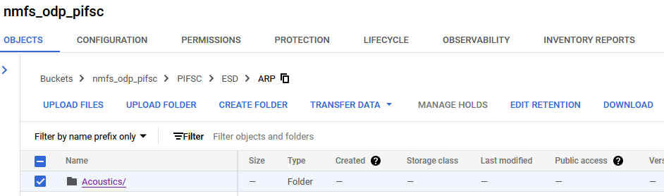

# PIFSC/ESD NOAA Cloud | How to Download
## Prerequisites : Install Google Command Line Tool(Gsutil) via the Google SDK installer
- Install:
  - https://cloud.google.com/storage/docs/gsutil_install#sdk-install

## Step 1: Browse Data via PIFSC Cloud Console 
- PIFSC Cloud Console URL
  - https://console.cloud.google.com/storage/browser/nmfs_odp_pifsc
### Step 1a: Select folder you wish to download


### Step 1b: Click Download | This will open up the download command


## Step 2: Run Download Script
### Simple NODD Download Script Example 01
- uses rsync command for "synchronizing files between a computer and a storage drive and across networked computers by comparing the modification times and sizes of files."
- allows for stop and restart of the download
```
gsutil -m rsync -r "gs://nmfs_odp_pifsc/PIFSC/ESD/ARP/Acoustics" C:/destination_folder_path
```
### Or use the Simple NODD Download Script Example 02
```
gsutil -m cp -r \
  "gs://nmfs_odp_pifsc/PIFSC/ESD/ARP/Acoustics" /
  .
```
 ### Download Notes
- Downloading 1 or more folders requires the google command-line tool.
- Only individual objects can be downloaded using the Cloud web Console.
- To download a folder or multiple objects at a time, you can run this code for the selected resources in the gsutil command line tool.

### Learn More about NOAA Open Data Dissemination(NODD) 
- NODD Homepage
  - https://www.noaa.gov/information-technology/open-data-dissemination

### NODD for other NMFS Centers:
- https://console.cloud.google.com/storage/browser/nmfs_odp_afsc
- https://console.cloud.google.com/storage/browser/nmfs_odp_swfsc
- https://console.cloud.google.com/storage/browser/nmfs_odp_nefsc
- https://console.cloud.google.com/storage/browser/nmfs_odp_nwfsc
- https://console.cloud.google.com/storage/browser/noaa-passive-bioacoustic
- https://console.cloud.google.com/storage/browser/noaa-nidis-drought-gov-data

### Other PIFSC NODD Links
- PIFSC NODD
  - https://console.cloud.google.com/welcome?project=nmfs-trusted-images
  - PIFSC Cloud Console URL
    - https://console.cloud.google.com/storage/browser/nmfs_odp_pifsc
  - PIFSC GSUtil URL
    - gs://nmfs_odp_pifsc
  - PIFSC Bucket API
    - https://www.googleapis.com/storage/v1/b/nmfs_odp_pifsc/o
### More Info: Google
  - Checkout the Quickstart:
  - https://cloud.google.com/storage/docs/discover-object-storage-gcloud
- Google SDK Docs
  - https://cloud.google.com/storage/docs/discover-object-storage-gsutil
  - https://cloud.google.com/sdk/docs
