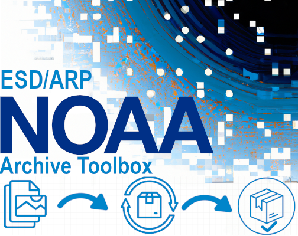
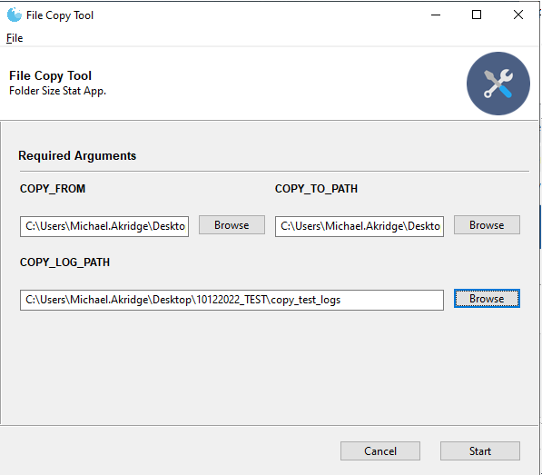
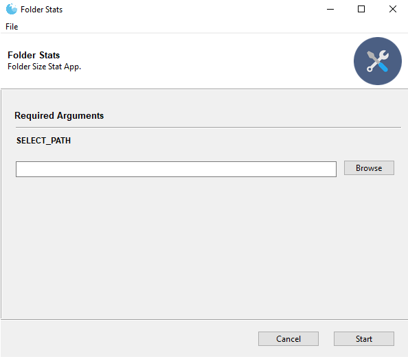
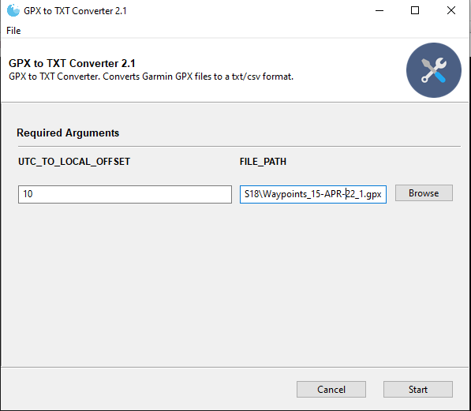
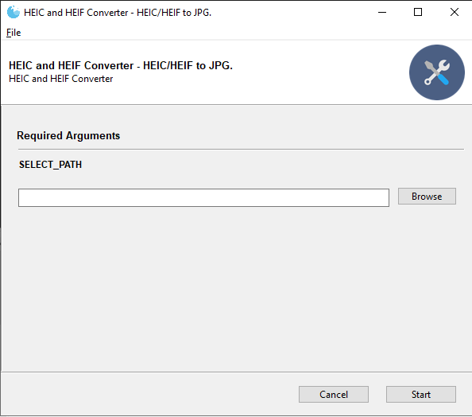
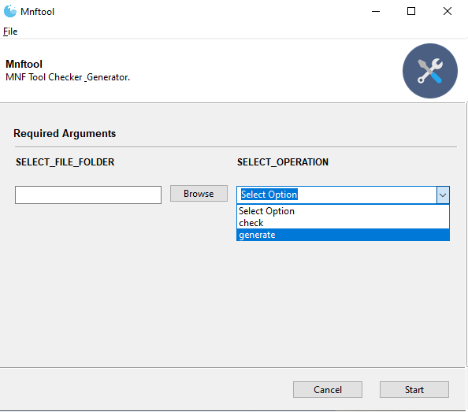
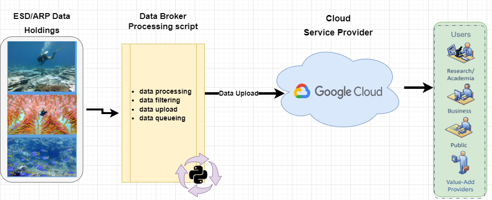
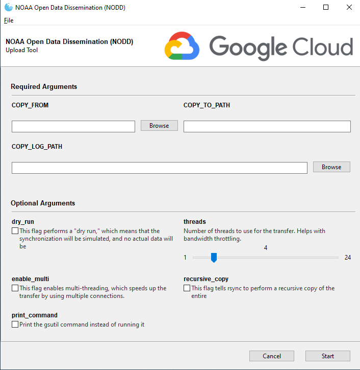

# ESD/ARP Archive Toolbox

Collection of Tools, Workflows and Processes to help Facilitate Archiving Scientific Data.

- Contact: Michael.Akridge@NOAA.gov

### Table of Contents
1. **[Archive Tools](#archive-tools)**
    * [File Copy Tool](#file-copy-tool)
    * [Folder Stats Tool](#folder-stats-tool)
    * [Garmin GPS File(GPX)Converter](#garmin-gps-filegpxconverter)
    * [Batch HEIC/HEIF to JPG Converter](#batch-heicheif-to-jpg-converter)
    * [Archive Manifest File Tool](#archive-manifest-file-tool)
    * [Other Archive Tools](#other-archive-tools)
2. **[Google Cloud Tools](#google-cloud-platform-upload-tools)**
    * [NOAA Open Data Dissemination (NODD) Workflow](#noaa-open-data-dissemination-nodd-workflow)
    * [NODD GUI Upload Tool](#nodd-gui-upload-tool)
    * [Simple NODD Upload Script Example ](#simple-nodd-upload-script-example)
    * [Simple NODD Download Script Example](#simple-nodd-download-script-example)
    * [NODD Details](#nodd-details)
***
# Archive Tools
<a href="./toolbox/desktop/file-copy-tool"></a>

### <a href="./toolbox/desktop/file-copy-tool">File Copy Tool</a>
File copy tool will copy files and directories from one place to another. 
* It uses a subprocess to call a windows robust file copy command
* The app will skip any existing files in a destination directory
* It will also run multi-threaded for performance
* If a copy process is interrupted, then simply run again since it also has the ability to restart the transfer.
- NOTE: Multiplatform versions available 

<br clear="right"/>

<a href="./toolbox/desktop/folder-stats-tool"></a>

### <a href="./toolbox/desktop/folder-stats-tool">Folder Stats Tool</a>
* Lightweight,python based, tool to gather folder stats like name, path, and size
* Exports a CSV of folder stats

<br clear="right"/>

<a href="./toolbox/desktop/garmin-gps-file-converter"></a>

### <a href="./toolbox/desktop/garmin-gps-file-converter">Garmin GPS File(GPX)Converter</a>
* Tool to convert Garmin GPS files(GPX) to standard CSV/TXT file format

<br clear="right"/>

<a href="./toolbox/desktop/heic-heif-converter"></a>

### <a href="./toolbox/desktop/heic-heif-converter">Batch HEIC/HEIF to JPG Converter</a>
* Tool to batch convert HEIC/HEIF files to standard JPG file format

<br clear="right"/>

<a href="./toolbox/desktop/archive-manifest-file-tool"></a>

### <a href="./toolbox/desktop/archive-manifest-file-tool">Archive Manifest File Tool</a>
* Tool to Verify or Generate Archive Manifest Files 
* Required when sending archive packages
### Manifest File Details  
* A separate manifest file is required for every file that is transferred
* A manifest file contains three text values comma delimited on one line with no spaces for each submitted file.
```
<file_name>,<file_md5_checksum>,<file_size_in_bytes>
```
* The manifest file name pattern is the name of the associated data file with an added '.mnf'.
```
<file_name>.mnf
```
<br clear="right"/>

## Other Archive Tools
### Send2NCEI(S2N) 
* Send2NCEI (S2N) is an archiving tool that allows you to easily submit your data files and related documentation to the National Centers for Environmental Information for long term preservation, stewardship, and access. 
* https://www.ncei.noaa.gov/archive/send2ncei/
### Advanced Tracking and Resource Tool for Archive Collections (ATRAC)
* The Advanced Tracking and Resource tool for Archive Collections (ATRAC) provides a common interface for users to enter and display information on archiving projects at the NOAA National Centers for Environmental Information (NCEI).
* https://www.ncdc.noaa.gov/atrac/guidelines.html
### PIFSC Centralized Data Tools - NCEI Tools Libary 
* PHP based tools. Data packager, bagit data packager, and submission manifest tools. 
* placeholder - link coming soon - placeholder
----------

# Google Cloud Platform Upload Tools
### NOAA Open Data Dissemination (NODD) Workflow


### <a href="./toolbox/cloud/NODD_Desktop_Upload_Tool/nodd_upload_tool.py">NODD GUI Upload Tool</a>
<a href="./toolbox/cloud/NODD_Desktop_Upload_Tool/nodd_upload_tool.py"></a>

## Requirements 
* GSUTIL backend: https://cloud.google.com/storage/docs/gsutil_install
* GCP Storage Bucket Permissions
* Python 3 and various packages

## Tool Details 
* syncs local data to Google Cloud Platform Storage using Google's gsutil backend
* Customizable gsutil command generation
* Logging and output message management
* Configurable parameters including dry run, multi-threading, and recursion
* A graphical user interface (GUI) is built using the Gooey library.
* Users can interact with the GUI to specify the source and destination paths, adjust threading, select a dry run, and decide whether to print or run the gsutil command.
* The main function fetches user input, configures the logger, and executes the copy process or prints the gsutil command based on user preference.

### Simple NODD Upload Script Example

```
gsutil -m rsync -r  C:\destination_folder_path gs://<bucket_name>/<destination_folder_path>
```

### Shell Script - List of Files - NODD Upload Script Example

```
#!/bin/bash

# List of files to upload
source_files=(
"C:\example\of\file\path\file.txt"
[ADD LIST of FILES HERE]
)

# Destination Google Cloud Storage bucket path
destination_bucket="gs://bucket_name/destination_folder_path..."

# Loop through the source file list and upload each file
for source_file in "${source_files[@]}"; do
    gsutil -o "GSUtil:parallel_thread_count=12" -m cp "$source_file" "$destination_bucket"
done
```

breakdown of what each flag and option does

- <b>gsutil</b>: This is the command-line tool for interacting with Google Cloud Storage. https://cloud.google.com/storage/docs/gsutil
- <b>-o "GSUtil:parallel_thread_count=12" </b> if use multi-threading, limit bandwidth usage with this flag
- <b>-m</b>: This flag enables multi-threading, which speeds up the transfer by using multiple connections.
- <b>rsync</b>: This is the command to synchronize files and directories between a local and a remote location.
- <b>-r</b>: This flag tells rsync to perform a recursive copy of the entire directory tree.
- <b>-n</b>: This flag performs a "dry run," which means that the synchronization will be simulated, and no actual data will be transferred. This is useful to preview what would happen if the command were executed without actually making any changes.
- <b>-x</b>: This flag excludes files and directories that match any of the specified patterns using regular expressions. 
- <b>local_dir</b> C:\nodd\test: This is the local directory that will be synchronized.
- <b>cloud_dir</b> gs://nmfs_odp_pifsc/PIFSC/ESD/ARP/test: This is the Google Cloud Storage bucket and destination path where the data will be synchronized.

The <b>-x </b>excluded patterns in detail we use are: 
- -x "(^.*(?<!\.JPG)$)|(.*_archive.*|.*_YEAR.*|.*ISLAND.*|.*SITE-ID.*|.*SITE_PHOTOS.*|.*uncorrected.*|.*MISC.*|.*DARK.*|.*Products.*)" 
- <b>(^.*(?<!\.JPG)$)</b>
- - Matches any files that do not end with the ".JPG" extension. 
- <b>(.*_archive.*|.*_YEAR.*|.*ISLAND.*|.*SITE-ID.*|.*SITE_PHOTOS.*|.*uncorrected.*|.*MISC.*|.*DARK.*|.*Products.*)</b>
- - Matches any files or directories that contain any of the specified strings.

</details>

### Simple NODD Download Script Example
```
gsutil -m rsync -r gs://<source_bucket_name>/<source_folder_path> C:\destination_folder_path
```

### NODD Details
NODD
- https://www.noaa.gov/information-technology/open-data-dissemination

PIFSC NODD
- https://console.cloud.google.com/welcome?project=nmfs-trusted-images
- Cloud Console URL
- - https://console.cloud.google.com/storage/browser/nmfs_odp_pifsc
- GSUtil URL
- - gs://nmfs_odp_pifsc
- Bucket API
- - https://www.googleapis.com/storage/v1/b/nmfs_odp_pifsc/o

NODD for other NMFS Centers:
- https://console.cloud.google.com/storage/browser/nmfs_odp_afsc
- https://console.cloud.google.com/storage/browser/nmfs_odp_swfsc
- https://console.cloud.google.com/storage/browser/nmfs_odp_nefsc
- https://console.cloud.google.com/storage/browser/nmfs_odp_nwfsc
- https://console.cloud.google.com/storage/browser/noaa-passive-bioacoustic
- https://console.cloud.google.com/storage/browser/noaa-nidis-drought-gov-data

Google Cloud SDK Docs
- https://cloud.google.com/sdk/docs
- https://cloud.google.com/storage/docs/discover-object-storage-gsutil
----------

----------
#### Disclaimer
This repository is a scientific product and is not official communication of the National Oceanic and Atmospheric Administration, or the United States Department of Commerce. All NOAA GitHub project content is provided on an ‘as is’ basis and the user assumes responsibility for its use. Any claims against the Department of Commerce or Department of Commerce bureaus stemming from the use of this GitHub project will be governed by all applicable Federal law. Any reference to specific commercial products, processes, or services by service mark, trademark, manufacturer, or otherwise, does not constitute or imply their endorsement, recommendation or favoring by the Department of Commerce. The Department of Commerce seal and logo, or the seal and logo of a DOC bureau, shall not be used in any manner to imply endorsement of any commercial product or activity by DOC or the United States Government.

## License
See the [LICENSE.md](./LICENSE.md) for details