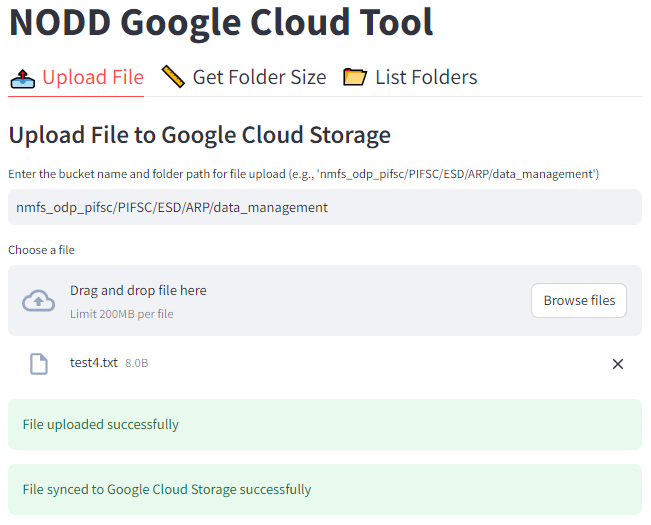
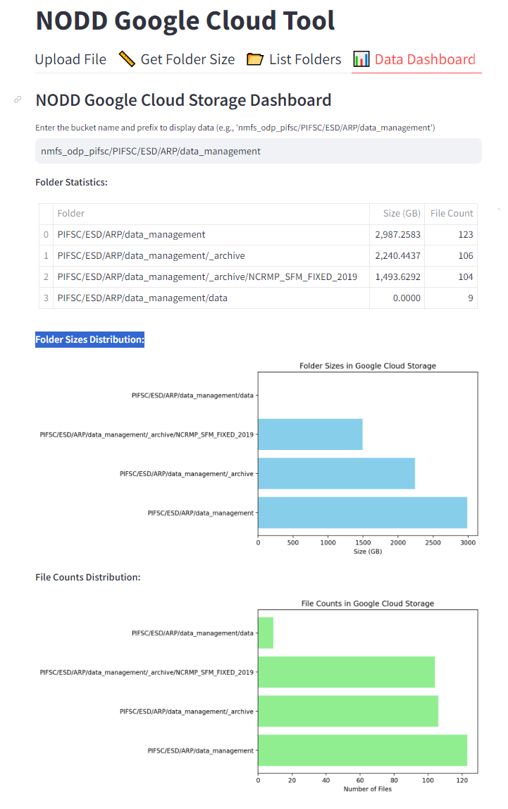
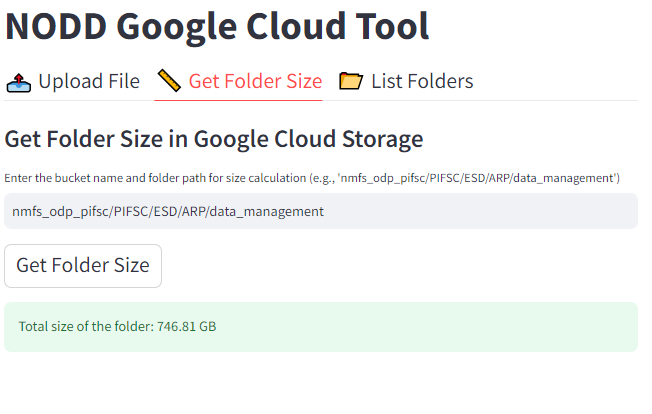
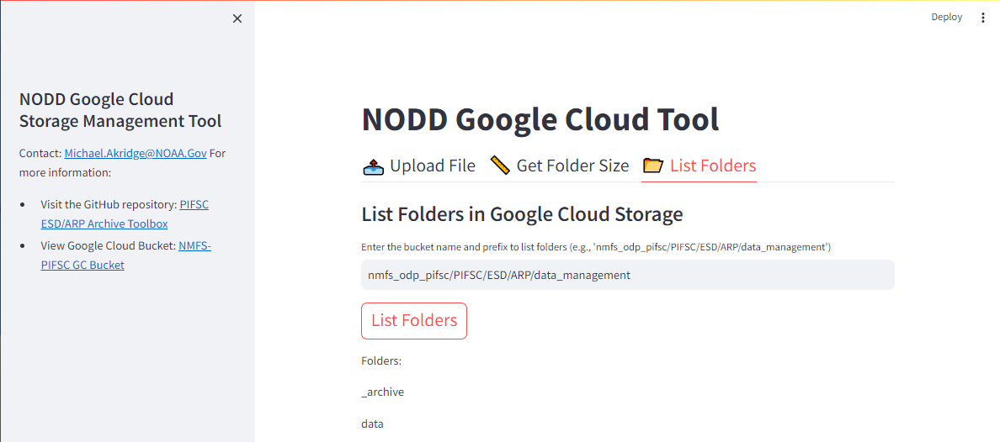

# NODD Docker App 03
NODD Google Cloud Web App Storage Management Tool. Lets users have easy interface to upload data, get folder sizes, list folders, and more. 



## Features
- Upload
- Get folder size
- List folders
- Data Dashboard (file size and counts)

## Other Screenshots




## Setup
### Add Credentials
## Example '.boto' File
```
[Credentials]
gs_access_key_id =YOUR_KEY_ID_HERE
gs_secret_access_key  YOUR_KEY_HERE
```
- use existing '.boto' crednetial file like this example
  - found under: "C:\Users\Firstname.Lastname\AppData\Roaming\gcloud\legacy_credentials\your.email@noaa.gov\"
  - or found under: "config\legacy_credentials\your.email@noaa.gov\"
- or create a new boto file with HMAC keys
  - Under google cloud storage settings > Interoperability tab > at bottom "Create a Key"


### Add Dockerfile
```
# Dockerfile
FROM google/cloud-sdk:latest

WORKDIR /app

# Copy application files
COPY ./ ./

# Copy the .boto configuration file
COPY ./credentials/.boto /root/.boto

# Install Python and required packages
RUN apt-get update && apt-get install -y python3-pip
RUN pip3 install -r requirements.txt

# Expose the port Streamlit will run on
EXPOSE 8501

ENTRYPOINT ["streamlit", "run", "nodd_upload_tool.py", "--server.port=8501", "--server.address=0.0.0.0"]
```
### Compose File
```
version: '3.8'
services:
  nodd-app:
    build:
      context: .
      dockerfile: Dockerfile
    volumes:
      - ./local_directory:/local_directory
    ports:
      - "8501:8501"
```
### requirements.txt
```
streamlit
google-cloud-storage
google-auth-httplib2
matplotlib
```
### Then Run
``
docker-compose up --build
``
### Go to app
```
http://localhost:8501/
```
