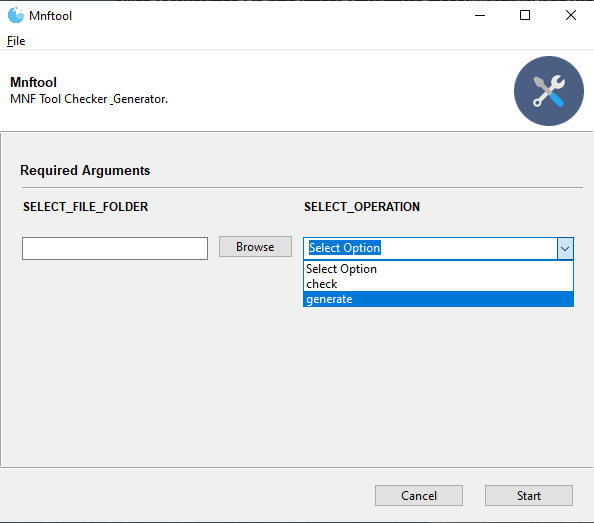

# Archive Manifest File Tool


* Tool to Verify or Generate Archive Manifest Files 
* Required when sending archive packages


### Manifest File Details  
* A separate manifest file is required for every file that is transferred
* A manifest file contains three text values comma delimited on one line with no spaces for each submitted file.
```
<file_name>,<file_md5_checksum>,<file_size_in_bytes>
```
* The manifest file name pattern is the name of the associated data file with an added '.mnf'.
```
<file_name>.mnf
```

## Contact
*  Michael.Akridge@noaa.gov

## Requirements
* Windows 10+

## Install
*  Download .exe
*  Note: Before running the app, right click the exe file > then select Properties 
*  Click unblock (only need to do so once)
*  Then just double click to run. 
