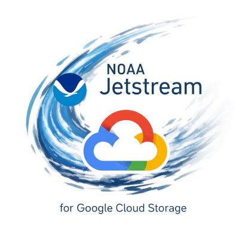

# NOAA Jetstream — Easy uploads to Google Cloud Storage

A simple python app to copy a local folder into a Google Cloud Storage (GCS) bucket. Pick a source folder, enter your bucket path, choose where to save a log, and click Start.

### What you need (one time install)
- Google Cloud SDK (includes gsutil)
- Python 3.10+
- Permissions to the target bucket

### 1) Install Google Cloud SDK
- Download and install: https://cloud.google.com/sdk/docs/install

### 2) Sign in to Google Cloud
In a terminal, sign in so gsutil can access your buckets:

```terminal
gcloud auth login --no-launch-browser
gcloud auth application-default login --no-launch-browser
```

Optional (for your notes):
- You can confirm access any time with: gsutil ls
- List your active account: gcloud auth list

### 3) Install Python packages
In terminal, from this folder:
```
pip install -r requirements.txt
```
If you don’t have pip or Python yet, install from https://www.python.org/ and try again.

## Start the app
In terminal, from this folder:
```
python jetstream.py
```
The NOAA Jetstream window will open.
<a href="./jetstream.py"></a>
## Use the app (step by step)
1) Source & Destination
- Copy From: pick the local folder you want to upload.
- Bucket Path: enter your destination path, for example:
  - nmfs_odp_pifsc/PIFSC/ESD/ARP/Photoquadrat Imagery
  - You can also paste a full path like gs://nmfs_odp_pifsc/PIFSC/ESD/ARP
- Log Directory: choose a folder to save the transfer log file.

2) Transfer Settings (optional)
- Dry Run: preview what would transfer without copying anything.
- Threads / Multi: leave defaults unless you need to tune speed.
- Recursive Copy: keeps subfolders included (recommended).
- Print Command: shows the exact gsutil command and does not run.

3) Start
- Click Start. A timestamped log file will be written in your chosen log folder (e.g., 09_03_2025_0921_jetstream_transfer.log).

That’s it. Your files will sync to the bucket path you entered.

## Tips
- If you see “gsutil not found”, reinstall Google Cloud SDK and reopen PowerShell.
- If you get a permissions error listing the bucket, ask a project admin to confirm your access to that bucket/path.
- Use Dry Run first if you’re unsure what will be copied.
- Advanced tab lets you exclude common folders or file types if needed.

## Optional: command-line mode
Run without the GUI (handy for automation):
```
python jetstream.py --cli --copy-from "C:\\data" --bucket-path "nmfs_odp_pifsc/PIFSC/ESD/ARP" --log-directory "C:\\logs" --dry-run
```
## Troubleshooting
- Can’t list or write to the bucket: confirm you’re signed in and have access.
- Bucket path format: you can enter with or without gs://, the app accepts either.
- Network/VPN issues: make sure you’re on a network that can reach Google Cloud.

## Version history
- v2.0: Cleaner UI, custom bucket paths, optional filters, improved logging
- v1.0: Initial release

## Support
Developed for NOAA. For help or feature requests, contact Michael Akridge or open an issue in the archive-toolbox repository.
