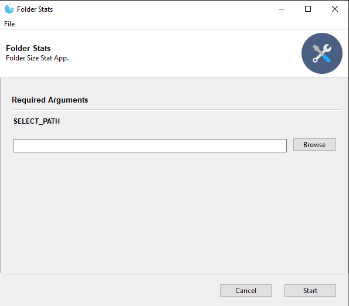
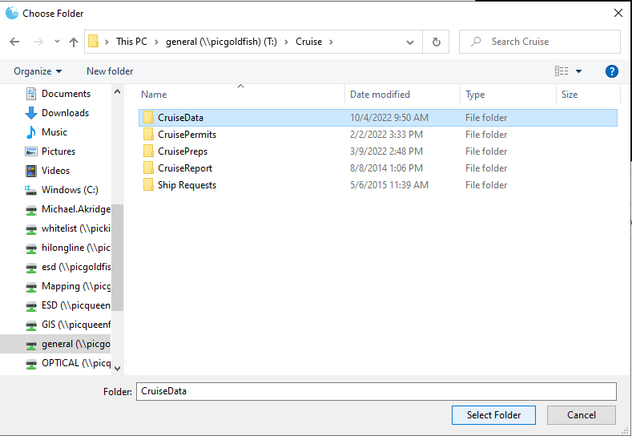
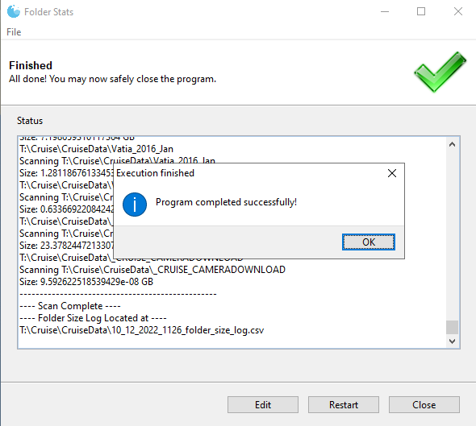
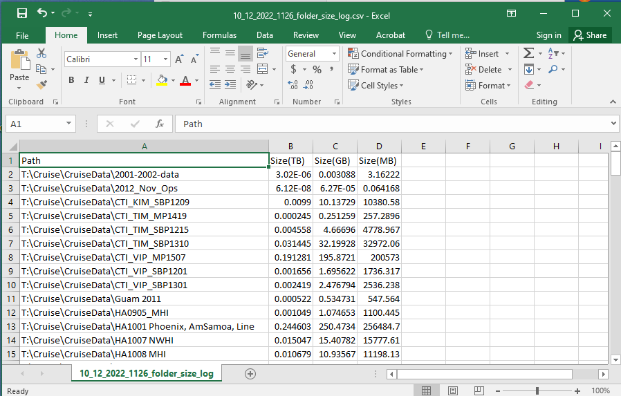

# Folder Stats Tool

## Table of Contents
1. **[Contact](#contact)**
3. **[Version](#version)**
4. **[Instructions](#instructions)**
5. **[Screenshots](#screenshots)**

## Contact
*  Michael.Akridge@noaa.gov

## Version
*  Python 3.9

## Instructions
* run folderstats.exe (right click and choose properties and unblock depending on settings)
* click browse and select folder
* press start
* wait while scan starts, and a status output will display when finished
* a CSV file with folder stats will be saved in the root of the scanned directory(example: 10_12_2022_1126_folder_size_log.csv)

esd-archive-toolbox
/toolbox/folder-stats-tool/

## Screenshots

