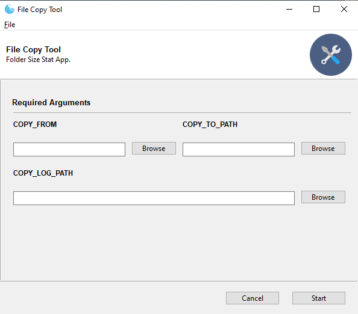
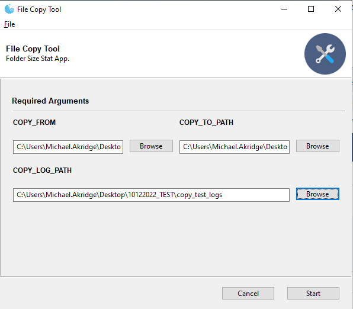
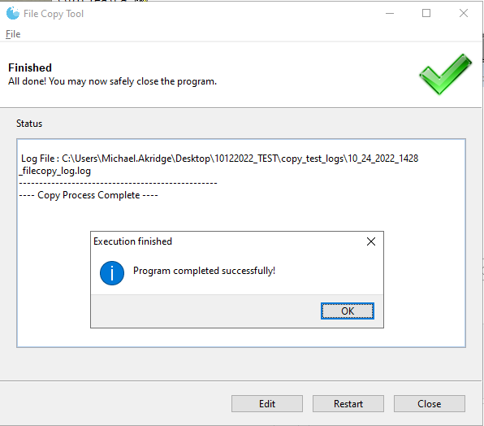
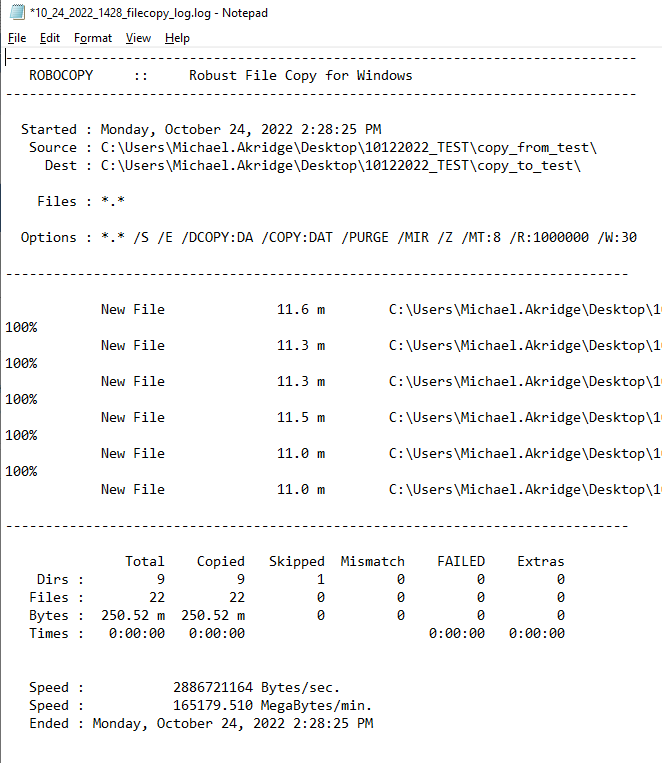

# File Copy Tool
File copy tool will copy files and directories from one place to another. 
* It uses a subprocess to call a windows robust file copy command
* The app will skip any existing files in a destination directory
* It will also run multi-threaded for performance
* If a copy process is interupted, then simply run again since it also has the ability to restart the transfer.

## Table of Contents
1. **[Contact](#contact)**
2. **[Requirements](#requirements)**
3. **[Install](#install)**
4. **[Instructions](#instructions)**
5. **[Screenshots](#screenshots)**

## Contact
*  Michael.Akridge@noaa.gov

## Requirements
* Windows 10+
* Robocopy installed if not already by default
* https://learn.microsoft.com/en-us/windows-server/administration/windows-commands/robocopy

## Install
*  Download filecopy_tool.exe
*  Note: Before running the app, right click the exe file > then select Properties 
*  Click unblock (only need to do so once)
*  Then just double click to run. 

## Instructions
* click browse(or copy paste) and select folders for the following: copy from location, copy to locaion, and path to save the copy log
* press start
* wait while copy runs. 
* (optional) open log file to check status if you wish
* Once complete, a status output will display when finished

## FAQ
- if copy run is blank or errors, close and run again. possible bug 

## Screenshots

