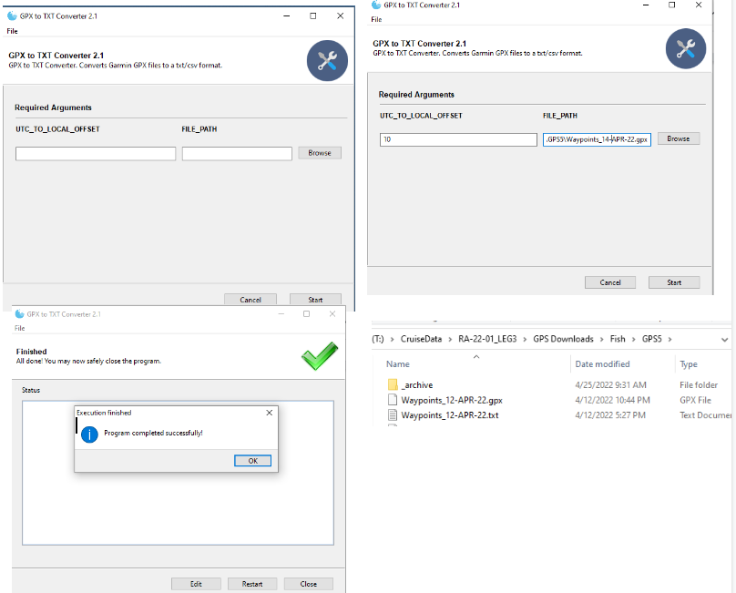
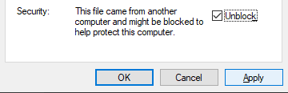
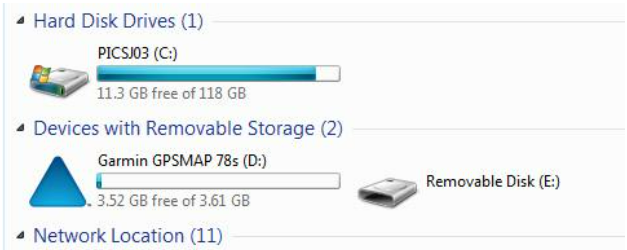
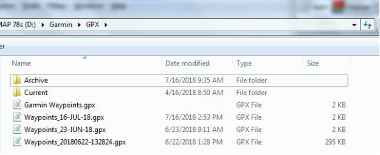

# Garmin GPS files(GPX) Converter
* Lightweight, python based, tool to convert Garmin GPS files(GPX) to standard TXT file format

## Table of Contents
1. **[Contact](#contact)**
2. **[Requirements](#requirements)**
3. **[Install](#install)**
4. **[Instructions](#instructions)**
5. **[Screenshots](#screenshots)**

## Contact
*  Michael.Akridge@noaa.gov

## Requirements
* Windows OS 
* or python w/ required libraries  installed

## Install
*  Download the ".exe" file
*  <b>Note:</b> First time Start, before running the app, right click the exe file > then select Properties 
*  Click unblock & apply (only need to do so once)
*  Then just double click to run. 



## Instructions
# Step 1. Download GPX file from the GPS Unit
How to download GPS Points (Garmin 78 model)
1.	Connect GPS to computer via USB port on back of GPS
2.	Open up “My Computer” Window (A GPS will show up as a removable storage device)

3.	Navigate to GPS file using a path like this: D:\Garmin\GPX
4.	GPS File is automatically broken up in a daily file
5.	Copy todays waypoint file to GPS Download folder in the cruise folder

```
Example: 
- “Waypoints_16-JUL-18.gps"
- To T:\Cruise\CruiseData\MP2108\GPS Downloads
```
Note: 
- 	Make sure to copy to the correct team and GPS folder

# Step 2. Download GPX file from the GPS Unit
* double click the .exe file
* click browse(or copy paste) and select file path 
* enter utc offset
* press start
* wait while  runs
* Once complete, a status output will display when finished
* the converter files will be placed in the same folder

## Screenshots


