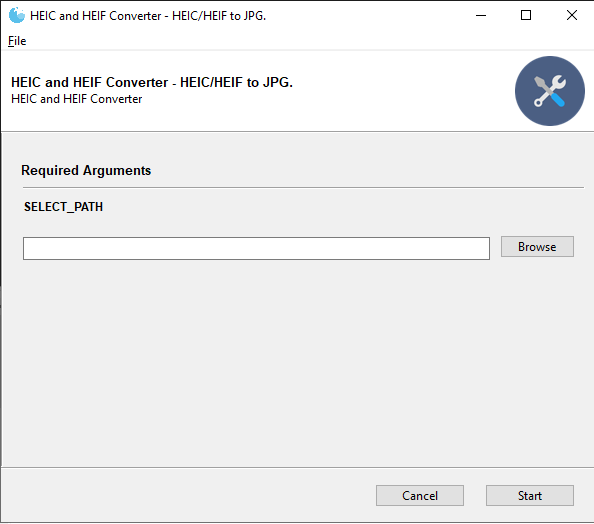
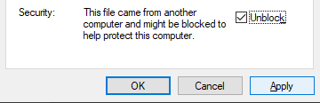
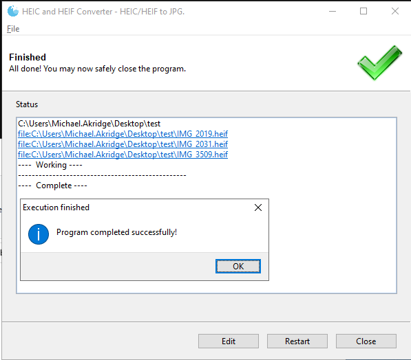
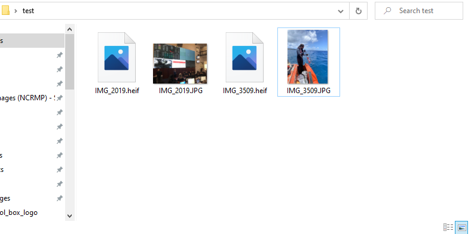

# HEIC and HEIF Converter
* Python based, Batch HEIC/HEIF to JPG Converter

## Table of Contents
1. **[Contact](#contact)**
2. **[Requirements](#requirements)**
3. **[Install](#install)**
4. **[Instructions](#instructions)**
5. **[Screenshots](#screenshots)**

## Contact
*  Michael.Akridge@noaa.gov

## Requirements
* Windows OS 
* or python w/ required libraries  installed

## Install
*  Download heic_Converter.exe
*  <b>Note:</b> First time Start, before running the app, right click the exe file > then select Properties 
*  Click unblock & apply (only need to do so once)
*  Then just double click to run. 

## Instructions
* click browse(or copy paste) and select folder 
* press start
* wait while  runs
* Once complete, a status output will display when finished
* the converter files will be placed in the same folder

## Screenshots

